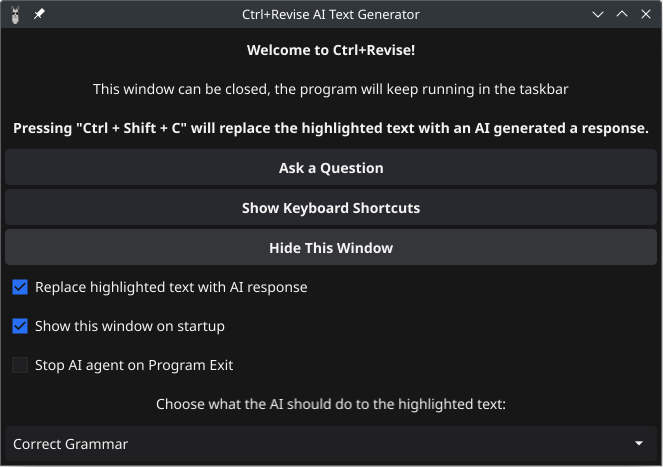

# Ctrl+Revise

- [Project overview](#project-overview)
- [Starting Ctrl+Revise](#starting-ctrlrevise)
- [Developing Ctrl+Revise](#developing-ctrlrevise)
- [Deploying Ctrl+Revise](#deploying-ctrlrevise)
- [About Ctrl+Revise](#about-ctrlrevise)


## Overview

Ctrl+Revise is locally-run artificial intelligence (AI) tool designed to elevate your writing standards. This desktop application works in any text program, providing real-time suggestions for improving your writing. Ctrl+Revise uses a large language model to analyze your text and suggest improvements, such as grammar corrections, sentence structure, and vocabulary enhancements.


Ctrl+Revise uses keyboard shortcuts that when pressed have the AI act on the text that is currently selected (highlighted) in the text editor and the response replaces the highlighted text and is added to the clipboard to be pasted elsewhere.

This tool is compatible Windows, Linux, and macOS, supporting AMD, Nvidia, and Apple M1 chip architectures.

None of the text you copy is stored or sent to any server. The AI model runs locally on your machine, ensuring your privacy and data security.

## Starting

Dependencies:

- [Ollama](https://ollama.com/)

Ollama is a tool for interacting with various LLMs. If it is already running on the machine Ctrl+Revise will connect to it. If it is not running and [Docker](https://docker.com) is running, Ctrl+Revise will pull the latest Ollama Docker image and manage running it.

For users who would like to run Ollama on their own, you can download the latest release from the [Ollama.com](https://ollama.com/download) website.

Arch Linux users can install Ollama from the official repository.

CPU Only:
```bash
pacman -S ollama
```
AMD Only:
```bash
pacman -S ollama-rocm
```
Nvidia Only:
```bash
pacman -S ollama-cuda
```

For Docker users, https://hub.docker.com/r/ollama/ollama provides the latest images for AMD and Nvidia GPUs.
Docker command for AMD GPUs:
```bash
docker run -d --device /dev/kfd --device /dev/dri -v ollama:/root/.ollama -p 11434:11434 --name ollama --restart=always ollama/ollama:rocm
```


Ctrl+Revise will attempt to connect to Ollama on startup. If it is not running it will attempt to start Ollama using Docker, first looking to see it the image is already downloaded, and if not, it will pull the latest image and start the container. Currently, the container image it pulls down is `ollama/ollama:rocm` which provides support for AMD GPUs.

To start the project, use the `go run` command in your terminal or the make recipe `make run` from the project's root directory.

After cloning the repository, navigate to the project folder and run the following command:
```console
go run .
```

## Developing

To develop the project, you need to have the following tools installed on your machine:
- [Go](https://golang.org/dl/)
- [Stringer](https://pkg.go.dev/golang.org/x/tools/cmd/stringer) (optional, runs from make recipe)
- [golangci-lint](https://golangci-lint.run/) (optional, runs from make recipe)

This project uses the Fyne Toolkit, learn more about the Fyne Toolkit at [fyne.io](https://fyne.io/).

#### The Stringer tool
This project uses the stringer tool, this will generate a `<type>_string.go` file with the `PromptMsg` type and its `String()` method. To generate the `string.go` file, use the make recipe `make stringer` or run the following command:
```bash
go run golang.org/x/tools/cmd/stringer@latest -linecomment -type=PromptMsg
```

## Screenshots




## About

The [**Ctrl+Revise**](https://ctrlplusrevise.com) is in early development and there are many features that are planned to be added. This project is open-source and you can contribute to it by submitting a pull request.
