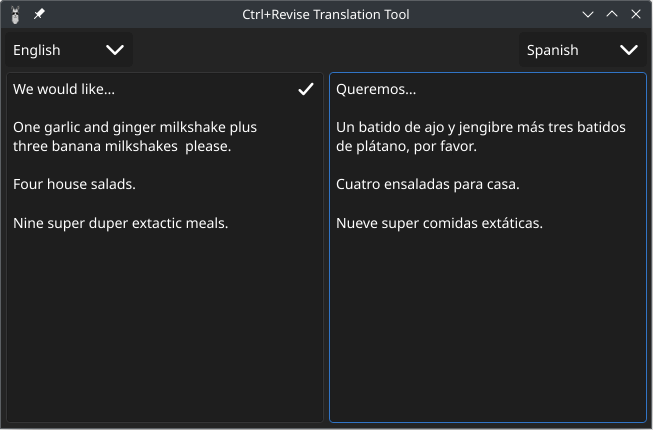

<div align="center">
  <p>
      <a href="https://github.com/bahelit/images/icon.png">
        
      </a>
      <br />
  </p>
</div>

  

* [Project overview](#project-overview)
* [Getting Started](#getting-started)
* [Developing Ctrl+Revise](#developing)

# Ctrl+Revise

Ctrl+Revise is an AI tool uses keyboard shortcuts that when pressed has an AI agent act on the text that is currently selected (highlighted) and the response replaces the highlighted text if writable and is added to the clipboard to be pasted elsewhere.

The AI models run locally on your machine, ensuring your privacy and data security.

Compatible with Windows, Linux, and MacOS, supporting AMD, Nvidia, and Apple M series chips architectures.

### Features

- **Keyboard shortcuts**: Uses keyboard shortcuts to provide quick responses without switching focus away to another program.
- **Local AI model**: Runs locally on your machine, ensuring your privacy and data security.
- **Multiple AI models**: Supports multiple AI models to provide a variety of suggestions.
- **Text Translation**: Supports translation to and from multiple languages.
- **Grammar Correction**: Corrects grammar mistakes in the text.
- **Change Tone**: Changes the tone of the text to be more formal or informal.
- **Summarize text**: Summarizes text to provide a concise version.
- **Expand text**: Expands text to provide more details.
- **Explain text**: Explains complex topics in simple terms.
- **Create Lists**: Creates bullet points and numbered lists from blocks of text.
- **Text reader**: Reads the highlighted text for visually impaired users.
- **Audio feedback**: Provides audio feedback for the suggestions made by the AI models.
- **Screen reader support**: Supports reading the highlighted text for visually impaired users.
- **Cross-platform compatibility**: Compatible with Windows, Linux, and macOS, supporting AMD, Nvidia, and Apple M1 chip architectures.

> [!CAUTION]
> The use of the Speak feature and text reader currently sends the text to a third-party (Google Translate) for processing.

> [!NOTE]
> The Speak feature and text reader are disabled by default and can be enabled in the settings.

## Getting Started

#### System Requirements:

- 8GB of RAM (GPU) or 16GB of RAM (CPU)

### Dependencies:
#### Ollama
- [Ollama](https://ollama.com/)

Ollama is a tool for interacting with various Large-Language-Models. It is used to interact with the AI models.

You can download the latest release from the [Ollama.com](https://ollama.com/download) website.

Arch Linux users can install Ollama from the official repository.

| CPU                     | AMD GPU                      | Nvidia GPU                     |
|-------------------------|------------------------------|--------------------------------|
| `sudo pacman -S ollama` | `sudo pacman -S ollama-rocm` | `sudo pacman -S ollama-nvidia` |

#### Ollama Server
If you have Ollama running on a different machine, you can configure the IP address and port in the settings or by setting 
the environment variable `OLLAMA_HOST` to the address of the machine running Ollama.
```bash
OLLAMA_HOST=http://<host-IP>:11434
```

#### Docker (optional)
If users select to use [Docker](https://docker.com) to run Ollama, Ctrl+Revise will pull the latest Ollama Docker image and manage running it.

The official [Ollama Docker image](https://hub.docker.com/r/ollama/ollama) `ollama/ollama` is available on Docker Hub.

_Docker command for CPUs:_
```bash
docker run -d -v ollama:/root/.ollama -p 11434:11434 --restart=always --name ollama ollama/ollama
```
_Docker command for Nvidia GPUs:_
```bash
docker run -d --gpus=all -v ollama:/root/.ollama -p 11434:11434 --restart=always --name ollama ollama/ollama
```
_Docker command for AMD GPUs:_
```bash
docker run -d --device /dev/kfd --device /dev/dri -v ollama:/root/.ollama -p 11434:11434 --name ollama --restart=always ollama/ollama:rocm
```
> [!NOTE]
> The Docker integration is disabled by default and can be enabled in the settings.

#### Xclip or Xsel (Linux only)
- [Xclip](https://github.com/astrand/xclip)
- [Xsel](http://www.vergenet.net/~conrad/software/xsel/)

Xclip or Xsel is used to interact with the clipboard on Linux systems. They are likely to be installed on your system already.

| Arch                   | Ubuntu                   | Fedora                  |
|------------------------|--------------------------|-------------------------|
| `sudo pacman -S xclip` | `sudo apt install xclip` | `sudo dnf instal xclip` |
| `sudo pacman -S xsel`  | `sudo apt install xsel`  | `sudo dnf instal xsel`  |


## Building from source

### Windows
Please follow the Getting Started guide from the Fyne documentation [here](https://docs.fyne.io/started/) to setup MSYS2 and compile from within the MingW-w64 window.

### MacOS
Set up the Xcode command line tools by opening a Terminal window and typing the following:

`xcode-select --install`

### Linux
Find the list of dependencies for your distro in the Fyne documentation [here](https://docs.fyne.io/started/)

To start the project run the following command:
```bash
git clone https://github.com/bahelit/ctrl_plus_revise.git
cd ctrl_plus_revise
go run .
```

> [!NOTE]
> The first time you run the project it will download the required models and may take a few minutes to start.

> [!NOTE]
> The first request can take a few seconds to respond as the model is loaded into memory. The memory is released after five minutes of inactivity.

## Developing

To develop the project, you need to have the following tools installed on your machine:
- [Go](https://golang.org/dl/)
- [Stringer](https://pkg.go.dev/golang.org/x/tools/cmd/stringer) (optional, runs from make recipe)
- [golangci-lint](https://golangci-lint.run/) (optional, runs from make recipe)

This project uses the Fyne Toolkit, learn more about the Fyne Toolkit at [fyne.io](https://fyne.io/).

#### The Stringer tool
This project uses the stringer tool, this will generate a `<type>_string.go` file with the data type and its `String()` method. To re-generate the `string.go` files after making code changes, use the following command:
```bash
make stringer
```

## Screenshots

|                   Main Menu                   |                      Keyboard Shortcuts                       |                     Translate Text                      |
|:---------------------------------------------:|:-------------------------------------------------------------:|:-------------------------------------------------------:|
|  |  |  |

## Contributing

[**Ctrl+Revise**](https://ctrlplusrevise.com) is in active development and there are many features that are planned to be added.

Contributions are welcome and will be fully credited.

## TODO
* [ ] Clipboard not working in flatpak even though it works native in Wayland
* [ ] Create AppImage package
* [ ] Create Snap package
* [ ] Settings menu for Ollama connection
* [ ] Docker - pull based on GPU type
* [ ] Bring back pop-up dialog on keyboard shortcut as an option
* [X] Windows, prevent console window from opening
* [X] UI Improvement - fix window resizing issues in Ask A Question window
* [ ] UI Improvement - show the model download progress percentage
* [ ] Improve Docker support - Check for new versions of Ollama and update
* [ ] Improve model management - Ability to remove models
* [ ] Image support (detect what is in the image using Llava or similar models)
* [ ] Image OCR support (read text out of an image using Llava or similar models)
* [ ] Localized language support ([go-i18n](https://github.com/nicksnyder/go-i18n))
* [ ] Local text to speech (considering [eSpeak](https://github.com/espeak-ng/espeak-ng) already in most Linux distros or [Coqui-AI TTS](https://github.com/coqui-ai/TTS))
* [ ] File and directory organizer (organize files and directories based on content)
* [ ] Right-click and hold brings up rotary menu for quick access to features (or keyboard shortcuts)
* [ ] Chatbot and chat history (chat with an AI and save the chat history)
* [ ] RAG (Retrieval-Augmented Generation) model support
