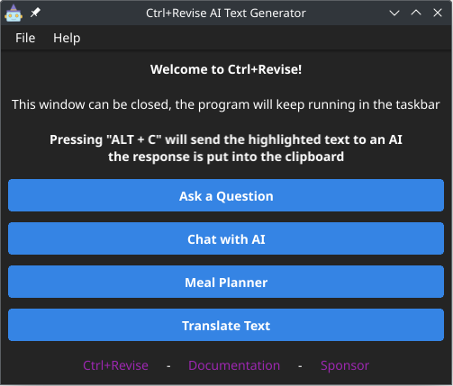

# Ctrl+Revise

- [Project overview](#project-overview)
- [Starting Ctrl+Revise](#starting-ctrlrevise)
- [Developing Ctrl+Revise](#developing-ctrlrevise)
- [Deploying Ctrl+Revise](#deploying-ctrlrevise)
- [About Ctrl+Revise](#about-ctrlrevise)


## Overview

Ctrl+Revise is locally-run artificial intelligence (AI) tool designed to elevate your writing standards. This desktop application works in any text program, providing real-time suggestions for improving your writing. Ctrl+Revise uses a large language model to analyze your text and suggest improvements, such as grammar corrections, sentence structure, and vocabulary enhancements.


Ctrl+Revise uses keyboard shortcuts that when pressed have the AI act on the text that is currently selected (highlighted) in the text editor and the response replaces the highlighted text and is added to the clipboard to be pasted elsewhere.

This tool is compatible Windows, Linux, and macOS, supporting AMD, Nvidia, and Apple M1 chip architectures.

The AI model runs locally on your machine, ensuring your privacy and data security.

[!CAUTION] The use of the Speak feature and text reader currently sends the text to a third-party (Google Translate) for processing.


## Features

- **Grammar suggestions**: Ctrl+Revise provides real-time grammar suggestions to improve your writing.
- **Vocabulary enhancements**: Ctrl+Revise suggests alternative words to improve your writing.
- **Sentence structure improvements**: Ctrl+Revise suggests sentence structure improvements to enhance your writing.
- **Keyboard shortcuts**: Ctrl+Revise uses keyboard shortcuts to provide real-time suggestions for your writing.
- **Local AI model**: Ctrl+Revise runs locally on your machine, ensuring your privacy and data security.
- **Cross-platform compatibility**: Ctrl+Revise is compatible with Windows, Linux, and macOS, supporting AMD, Nvidia, and Apple M1 chip architectures.
- **Audio feedback**: Ctrl+Revise provides audio feedback for the suggestions made by the AI model.
- **Screen reader support**: Ctrl+Revise supports reading the highlighted for visually impaired users.

[!NOTE] The Speak feature and text reader are disabled by default and can be enabled in the settings.

[!NOTE] The Docker integration is disabled by default and can be enabled in the settings.

## Starting

System Requirements:

- 8GB of RAM (GPU) or 16GB of RAM (CPU)

Dependencies:

- [Ollama](https://ollama.com/)

Ollama is a tool for interacting with various Large-Language-Models. If it is already running on the machine Ctrl+Revise will connect to it, if Ollama is not already running it will be started.

For [Docker](https://docker.com) users you can select to use Docker, Ctrl+Revise will pull the latest Ollama Docker image and manage running it.

To install the docker container manually [Ollama Docker Image](https://hub.docker.com/r/ollama/ollama) provides the latest images for AMD and Nvidia GPUs.

_Docker command for AMD GPUs:_
```bash
docker run -d --device /dev/kfd --device /dev/dri -v ollama:/root/.ollama -p 11434:11434 --name ollama --restart=always ollama/ollama:rocm
```

For users who would like to run Ollama on their own, you can download the latest release from the [Ollama.com](https://ollama.com/download) website. 

Ctrl+Revise will start Ollama for you if it is not already running.

Arch Linux users can install Ollama from the official repository.

| CPU                     | AMD GPU                      | Nvidia GPU                     |
|-------------------------|------------------------------|--------------------------------|
| `sudo pacman -S ollama` | `sudo pacman -S ollama-rocm` | `sudo pacman -S ollama-nvidia` |


To start the project run the following command:
```bash
git clone https://github.com/bahelit/ctrl_plus_revise.git
cd ctrl_plus_revise
go run .
```

## Developing

To develop the project, you need to have the following tools installed on your machine:
- [Go](https://golang.org/dl/)
- [Stringer](https://pkg.go.dev/golang.org/x/tools/cmd/stringer) (optional, runs from make recipe)
- [golangci-lint](https://golangci-lint.run/) (optional, runs from make recipe)

This project uses the Fyne Toolkit, learn more about the Fyne Toolkit at [fyne.io](https://fyne.io/).

#### The Stringer tool
This project uses the stringer tool, this will generate a `<type>_string.go` file with the `PromptMsg` type and its `String()` method. To generate the `string.go` file, use the make recipe `make stringer` or run the following command:
```bash
go install golang.org/x/tools/cmd/stringer@latest
go generate ./...
```

## Screenshots

|                   Main Menu                   |                      Keyboard Shortcuts                       |                     Managing models                     |
|:---------------------------------------------:|:-------------------------------------------------------------:|:-------------------------------------------------------:|
|  |  |  |

## About

[**Ctrl+Revise**](https://ctrlplusrevise.com) is in early development and there are many features that are planned to be added. This project is open-source and you can contribute to it by submitting a pull request.
