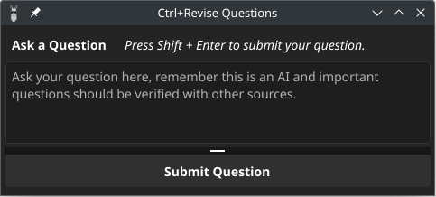

<div align="center">
  <p>
    <h1>
      <a href="https://github.com/bahelit/images/icon.png">
        
      </a>
      <br />
      Ctrl+Revise
    </h1>
    <h4>Powerful yet simple AI tool.</h4>
  </p>
</div>

* [Project overview](#project-overview)
* [Starting Ctrl+Revise](#building-from-source)
* [Developing Ctrl+Revise](#developing-ctrlrevise)
* [About Ctrl+Revise](#about-ctrlrevise)

## Overview

Ctrl+Revise is locally-run artificial intelligence (AI) tool designed to elevate your writing standards. This desktop application works in any text program, providing real-time suggestions for improving your writing. Ctrl+Revise uses a large language model to analyze your text and suggest improvements, such as grammar corrections, sentence structure, and vocabulary enhancements.


Ctrl+Revise uses keyboard shortcuts that when pressed have the AI act on the text that is currently selected (highlighted) in the text editor and the response replaces the highlighted text and is added to the clipboard to be pasted elsewhere.

This tool is compatible Windows, Linux, and macOS, supporting AMD, Nvidia, and Apple M1 chip architectures.

The AI model runs locally on your machine, ensuring your privacy and data security.

## Features

- **Local AI model**: Runs locally on your machine, ensuring your privacy and data security.
- **Keyboard shortcuts**: Uses keyboard shortcuts to provide quick responses without switching focus away to another program.
- **Grammar suggestions**: Provides a grammar correcter to improve your writing.
- **Vocabulary enhancements**: Will come up with alternative words and expand on topics.
- **Translation**: Can translate text to and from multiple languages.
- **Audio feedback**: Provides audio feedback for the suggestions made by the AI models.
- **Screen reader support**: Supports reading the highlighted text for visually impaired users.
- **Cross-platform compatibility**: Compatible with Windows, Linux, and macOS, supporting AMD, Nvidia, and Apple M1 chip architectures.

> [!CAUTION]
> The use of the Speak feature and text reader currently sends the text to a third-party (Google Translate) for processing.

> [!NOTE]
> The Speak feature and text reader are disabled by default and can be enabled in the settings.
>
> The Docker integration is disabled by default and can be enabled in the settings.

## Starting

#### System Requirements:

- 8GB of RAM (GPU) or 16GB of RAM (CPU)

#### Dependencies:
##### Ollama
- [Ollama](https://ollama.com/)

Ollama is a tool for interacting with various Large-Language-Models. It is used to interact with the AI models.

Users running [Docker](https://docker.com) can select to use Docker to run Ollama, Ctrl+Revise will pull the latest Ollama Docker image and manage running it.

To install the docker container manually [Ollama Docker Image](https://hub.docker.com/r/ollama/ollama) provides the latest images for AMD and Nvidia GPUs.

_Docker command for AMD GPUs:_
```bash
docker run -d --device /dev/kfd --device /dev/dri -v ollama:/root/.ollama -p 11434:11434 --name ollama --restart=always ollama/ollama:rocm
```

For users who would like to run Ollama on their own, you can download the latest release from the [Ollama.com](https://ollama.com/download) website.

Arch Linux users can install Ollama from the official repository.

| CPU                     | AMD GPU                      | Nvidia GPU                     |
|-------------------------|------------------------------|--------------------------------|
| `sudo pacman -S ollama` | `sudo pacman -S ollama-rocm` | `sudo pacman -S ollama-nvidia` |

Ctrl+Revise will start Ollama for you if it is not already running.

If you have Ollama running on a different machine, you can configure the IP address and port in the settings or by setting 
the environment variable `OLLAMA_HOST` to the address of the machine running Ollama.
```bash
OLLAMA_HOST=http://<host-IP>:11434
```

##### Xclip or Xsel
- [Xclip](https://github.com/astrand/xclip)
- [Xsel](http://www.vergenet.net/~conrad/software/xsel/)

Xclip or Xsel is used to interact with the clipboard on Linux systems. They are likely to be installed on your system already.

| Arch                   | Ubuntu                   | Fedora                  |
|------------------------|--------------------------|-------------------------|
| `sudo pacman -S xclip` | `sudo apt install xclip` | `sudo dnf instal xclip` |
| `sudo pacman -S xsel`  | `sudo apt install xsel`  | `sudo dnf instal xsel`  |

#### Building from source

##### Windows
Please follow the Getting Started guide from the Fyne documentation [here](https://docs.fyne.io/started/) to setup MSYS2 and compile from within the MingW-w64 window.

##### MacOS
Set up the Xcode command line tools by opening a Terminal window and typing the following:

`xcode-select --install`

##### Linux
Find the list of dependencies for your distro in the Fyne documentation [here](https://docs.fyne.io/started/)

To start the project run the following command:
```bash
git clone https://github.com/bahelit/ctrl_plus_revise.git
cd ctrl_plus_revise
go run .
```


> [!NOTE]
> The first time you run the project it will download the required models and may take a few minutes to start.
> 
> The first request can take a few seconds to respond as the model is loaded into memory. The memory is released after five minutes of inactivity.

## Developing

To develop the project, you need to have the following tools installed on your machine:
- [Go](https://golang.org/dl/)
- [Stringer](https://pkg.go.dev/golang.org/x/tools/cmd/stringer) (optional, runs from make recipe)
- [golangci-lint](https://golangci-lint.run/) (optional, runs from make recipe)

This project uses the Fyne Toolkit, learn more about the Fyne Toolkit at [fyne.io](https://fyne.io/).

#### The Stringer tool
This project uses the stringer tool, this will generate a `<type>_string.go` file with the data type and its `String()` method. To re-generate the `string.go` files after making code changes, use the following command:
```bash
make stringer
```

## Screenshots

|                   Main Menu                   |                      Keyboard Shortcuts                       |                        Ask A Question                        |
|:---------------------------------------------:|:-------------------------------------------------------------:|:------------------------------------------------------------:|
|  |  |  |

## About

[**Ctrl+Revise**](https://ctrlplusrevise.com) is in early development and there are many features that are planned to be added. This project is open-source and you can contribute to it by submitting a pull request.

## TODO
* [ ] Add support for Flatpak under Wayland (clipboard not working)
* [ ] Create Snap package
* [ ] Create AppImage package
* [X] Pull model after changing selection
* [ ] Windows, prevent console window from opening
* [ ] Improve UI
* [X] Improve UI - fix window resizing issues in Ask A Question window
* [X] Improve UI - show the model download progress
* [ ] Improve Docker support
* [ ] Improve model management
* [X] Add more AI models
* [ ] Image support (detect what is in the image)
* [ ] Image OCR support (read text out of an image)
* [ ] File and directory organizer (organize files and directories based on content)
* [ ] Add chatbot feature
